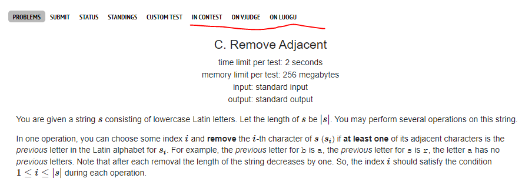
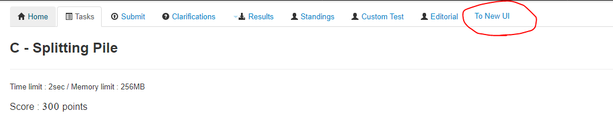

# CP-Jumper
(Chrome Extension) A quick link jump between different versions of problems
# Support
Jump between [Vjudge](https://www.vjudge.net) [Luogu](https://www.luogu.com.cn) [Codeforces Problemset](https://codeforces.com/problemset) and [Codeforces Contests](https://www.codeforces.com/contests) for a Codeforces problem

Jump between old UI and new UI of an Atcoder problem.
# Picture

# Install
Go to releases and download the CRX. Double click or drag it into your Chrome to install! 

Some Chrome may not support this. In this situation, you may need to install as developers.

Thanks CF user [tuwuna](https://codeforces.com/profile/tuwuna) for making the GIF!
